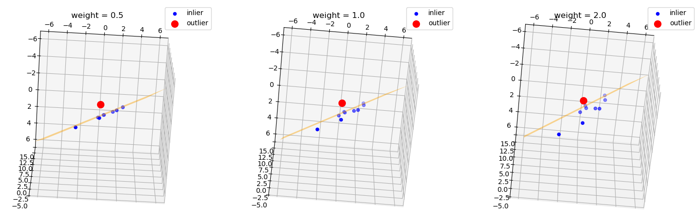

# weighted_plane_fit



## Compile

### Dependency

- **`ubuntu20.04`**
- **`Eigen`**

### Build
```
git clone weighted_plane_fit.git
cd weighted_plane_fit
mkdir build
cd build
cmake ..
make
```

## Usage

### Run

First, run the executable file.
```
./plane_fit
```
The program will randomly generate a point set according to the set parameters and save the point set and fitting results in the data folder.

### Visualization

Then use Python scripts to visualize the point set and fitting results.
```
python3 ../src/plot_results.py
```
You can modify the distribution range of points, plane model parameters, and weights to test the plane fitting results under different weights.

### Developer

YunSu
